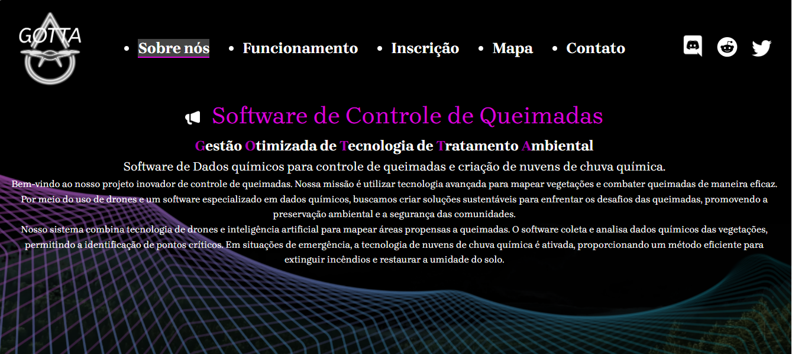

# Site sobre Queimadas

Este projeto foi desenvolvido como parte de um trabalho acadêmico e tem como objetivo apresentar um software de controle de queimadas para evitar o impacto das queimadas no meio ambiente.

## Páginas

O site foi desenvolvido em HTML, CSS, Javascript e .NOT
É composto por 5 páginas:

### - Sobre Nós
### - Funcionamento
### - Inscrição
### - Mapa
### - Contato

## Tecnologias utilizadas

- Frontend: HTML, CSS, JavaScript

## Sobre o Projeto

O site foi pensado para ser intuitivo, acessível e funcional, atendendo a um propósito social e educativo. Ele também busca incentivar a participação ativa da comunidade na preservação ambiental.

## Participantes:

- FILIPE TEIXEIRA TERTO (Eu) - Responsável pela criação do site (Frontend - HTML, CSS e Javascript)
- MICHELLE KAOLIN VIEIRA SOUZA - Responsável pela UX e design do site
- PEDRO HENRIQUE MARTINS SILVA - Responsável pelo design e Backend do site (.NET)
- DANIELA GABRIEL DE PAULA - Responsável pela arquitetura e design do site

  
